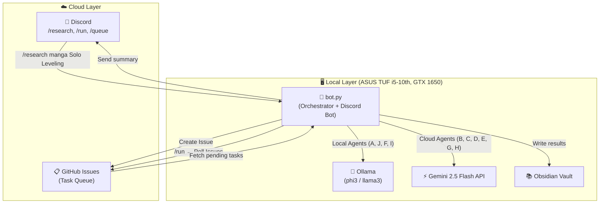
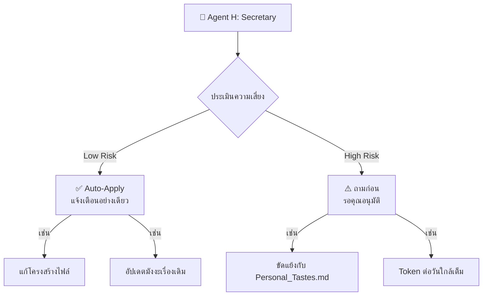

# 🏛️ The Sovereign AI — Full System Workflow

## System Architecture



## Agent Pipeline (Data Flow)

```mermaid
graph LR
    subgraph PHASE1["เฟส 1: สั่งงาน"]
        USER["👤 คุณ"] -->|"/research"| DC["💬 Discord"]
        DC -->|"Create Issue"| GH["📋 GitHub"]
    end

    subgraph PHASE2["เฟส 2: Pre-Processing"]
        GH -->|"/run"| A["🔍 A: Gatekeeper<br/>🖥️ LOCAL"]
        A -->|"constraints"| B["📋 B: Strategist<br/>☁️ CLOUD"]
    end

    subgraph PHASE3["เฟส 3: วิจัย"]
        B -->|"research plan"| C["🌐 C: Hunter<br/>☁️ CLOUD"]
        C -->|"raw data"| J["🗜️ J: Compressor<br/>🖥️ LOCAL"]
    end

    subgraph PHASE4["เฟส 4: วิเคราะห์"]
        J -->|"clean data"| D["🧵 D: Weaver<br/>☁️ CLOUD"]
        D -->|"Thai draft"| E["⚔️ E: Opponent<br/>☁️ CLOUD"]
    end

    subgraph PHASE5["เฟส 5: จัดเก็บ+รายงาน"]
        E -->|"critique"| F["✅ F: Auditor<br/>🖥️ LOCAL"]
        F -->|"final content"| G["🏗️ G: Architect<br/>☁️ CLOUD"]
        G -->|"obsidian file"| H["📨 H: Secretary<br/>☁️ CLOUD"]
        H -->|"summary"| I["📊 I: Optimizer<br/>🖥️ LOCAL"]
    end

    style A fill:#2d5016,color:#fff
    style J fill:#2d5016,color:#fff
    style F fill:#2d5016,color:#fff
    style I fill:#2d5016,color:#fff
    style B fill:#1a3a5c,color:#fff
    style C fill:#1a3a5c,color:#fff
    style D fill:#1a3a5c,color:#fff
    style E fill:#1a3a5c,color:#fff
    style G fill:#1a3a5c,color:#fff
    style H fill:#1a3a5c,color:#fff
```



## Agent Details

| # | Agent | ชื่อ | โหมด | หน้าที่ | Input → Output |
|---|---|---|---|---|---|
| 1 | **A** | Gatekeeper (บรรณารักษ์) | 🖥️ LOCAL | อ่าน `02_Lessons_Learned/` ดึง constraints | Task → Warnings & Constraints |
| 2 | **B** | Strategist (นักวางแผน) | ☁️ CLOUD | วางแผนวิจัย Tree of Thoughts เป็นภาษาอังกฤษ | Task + Constraints → Research Plan |
| 3 | **C** | Hunter (นักล่าข้อมูล) | ☁️ CLOUD | ค้นหาจากแหล่งข้อมูล (Reddit, Wiki, SO) | Plan → Raw Data |
| 4 | **J** | Compressor (คัดแยกขยะ) | 🖥️ LOCAL | ตัด HTML, โฆษณา, ลด Token | Raw Data → Clean Data |
| 5 | **D** | Weaver (ช่างทอประสาน) | ☁️ CLOUD | แปลเป็นไทย + เชื่อมโยงความรู้เดิม | Clean Data → Thai Draft |
| 6 | **E** | Opponent (จอมจับผิด) | ☁️ CLOUD | Red Teaming, หาจุดอ่อน, Devil's Advocate | Draft → Critique |
| 7 | **F** | Auditor (ผู้ตรวจ QA) | 🖥️ LOCAL | เช็คตัวเลข วันที่ JSON/MD format | Draft + Critique → Final Content |
| 8 | **G** | Architect (สถาปนิก) | ☁️ CLOUD | เขียนลง Obsidian + Mermaid + RankME JSON | Content → Obsidian File |
| 9 | **H** | Secretary (เลขาฯ) | ☁️ CLOUD | สรุปผล + Threshold 2 (Low/High Risk) | File → Discord Message |
| 10 | **I** | Optimizer (วิศวกร) | 🖥️ LOCAL | บันทึก Log + เสนอปรับปรุง Prompt | All Results → AI_Evolution_Log |

## Cost Optimization

```
Total Agents:  10
├── 🖥️ LOCAL (Ollama):  4 agents  (A, J, F, I)  →  ฟรี
├── ☁️ CLOUD (Gemini):   6 agents  (B, C, D, E, G, H)  →  ใช้ Token
└── Fallback: ถ้า Ollama ปิด → LOCAL agents auto-switch ไป Cloud
```

## Threshold 2 Governance (Agent H)



## Discord Commands

| คำสั่ง | ตัวอย่าง | หน้าที่ |
|---|---|---|
| `/ping` | `/ping` | ทดสอบว่า Bot ออนไลน์ |
| `/research <topic> <subject>` | `/research manga Solo Leveling` | สร้างคิวงาน (GitHub Issue) |
| `/queue` | `/queue` | ดูสถานะคิว: Pending / Processing / Completed |
| `/run` | `/run` | ดึง Issue ที่ค้าง → รัน Pipeline ทันที |

## Obsidian Vault Structure

```
My_Sovereign_Vault/
├── 01_Research/              ← ผลการวิจัย (Agent G เขียน)
│   ├── Manga/                   (One_Piece.md, Solo_Leveling.md)
│   ├── Coding/                  (Python, Node.js)
│   └── Trading/                 (XAU/USD Analysis)
├── 02_Lessons_Learned/       ← Agent A อ่านจากที่นี่
│   ├── Personal_Tastes.md       (ชอบ/ไม่ชอบ)
│   ├── Failure_Logs.md          (บทเรียนความผิดพลาด)
│   └── Source_Rank.md           (ความน่าเชื่อถือของเว็บ)
├── 03_System_Logs/           ← Agent I เขียนลงที่นี่
│   ├── AI_Evolution_Log.md      (ตารางสรุปการพัฒนา)
│   └── Token_Usage.md           (ประวัติการใช้ Token)
└── 04_Templates/             ← แม่แบบ
    ├── Manga_Template.md        (มี JSON Schema สำหรับ RankME)
    └── Lesson_Template.md
```

## Project File Structure

```
D:\The Sovereign AI/
├── bot.py                    ← 🤖 Discord Bot + Orchestrator (รันไฟล์นี้ไฟล์เดียว)
├── main.py                   ← 📦 Standalone orchestrator (สำรอง)
├── .env                      ← 🔐 API Keys (DISCORD, GITHUB, GEMINI, TAVILY)
├── requirements.txt
├── agents/
│   ├── agent_manager.py      ← 🧠 จัดการ Cloud/Local switching
│   └── prompts.py            ← 💬 System Prompts ของ Agent A-I
├── config/
│   └── settings.py           ← ⚙️ โหลด .env
├── cache/                    ← 📁 ลดการเรียก API ซ้ำ
└── ObsidianVault/            ← 📚 Knowledge Base
```
