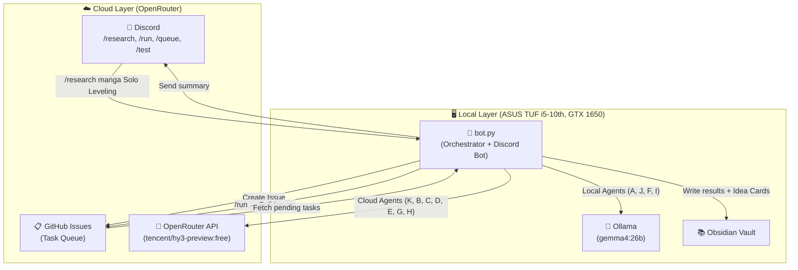
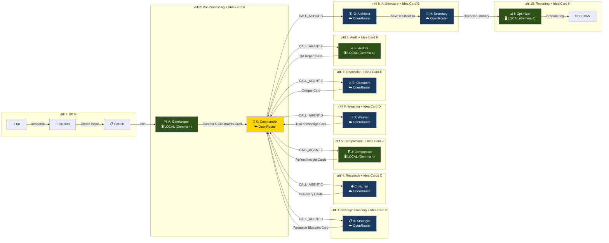
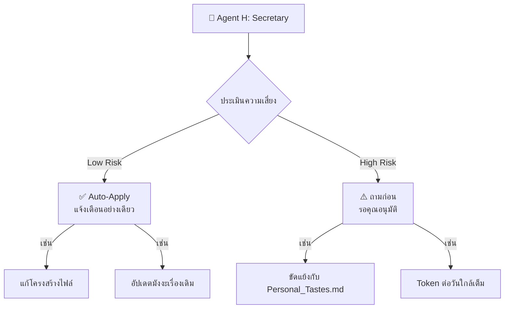

# 🏛️ The Sovereign AI — Full System Workflow

## System Architecture



## Agent Pipeline (Data Flow with Idea Cards)



## Idea Card Protocol

Every agent produces a **Detailed Idea Card** before passing to the next agent:

### Structure of an Idea Card:
```
[Agent ID]: Name of the creator
[Process]: Detailed log of reasoning/methodology (Long-form)
[Data/Findings]: Core output or discovered information
[Next Step Guidance]: Specific instructions for the successor
```

### Agent-Specific Card Tasks:
| Agent | Card Type | Description |
|-------|-----------|-------------|
| **A (Gatekeeper)** | Context & Constraints Card | Based on Obsidian history + Lessons Learned |
| **B (Strategist)** | Research Blueprint Card | Multi-angle questions + gap-focused plan |
| **C (Hunter)** | Discovery Cards | One card per major source found |
| **J (Compressor)** | Refined Insight Cards | Cleaned, compressed data from Discovery Cards |
| **D (Weaver)** | Thai Knowledge Card | Translated + merged structured data |
| **E (Opponent)** | Critique Card | Blind spots + counter-arguments found |
| **F (Auditor)** | QA Report Card | Verification results (PASS/FAIL) + errors |
| **G (Architect)** | Architecture Card | Merged all cards into final Obsidian file |
| **H (Secretary)** | Summary Card | Discord-friendly summary + Threshold 2 report |
| **I (Optimizer)** | Performance Card | Token savings + session metrics |

## KnowledgeChain Persistence

The `KnowledgeChain` class accumulates all Idea Cards and handles saving:

### 1. Session Log (03_System_Logs/)
- **File**: `Session_Log_[YYYY-MM-DD].md`
- **Format**: Thread format showing evolution from Agent A → I
- **Append Mode**: New sessions appended throughout the day

### 2. Research File (01_Research/)
- **File**: `01_Research/{Topic}/{subject}.md`
- **Content**: All Idea Cards merged into comprehensive research file
- **Metadata**: JSON block with Sovereign AI metadata

### 3. Idea Card Flow:
```
Agent generates output → Extract Idea Card → Add to KnowledgeChain → Save to Session Log
                                                                       ↓
                                                              FINALIZE: Save Research File
```

## Agent Details

| # | Agent | ชื่อ | โมเดล | หน้าที่ | Input → Output |
|---|-------|------|--------|----------|------------------|
| 1 | **K** | Commander (ผู้บัญชาการ) | ☁️ OpenRouter (tencent/hy3-preview:free) | Orchestrate pipeline, JSON decisions | Task → CALL_AGENT/SHORT_CIRCUIT/LOOP/FINALIZE |
| 2 | **A** | Gatekeeper (บรรณารักษ์) | 🖥️ LOCAL (Gemma 4) | อ่าน `02_Lessons_Learned/` ดึง constraints | Task → Context & Constraints Card |
| 3 | **B** | Strategist (นักวางแผน) | ☁️ OpenRouter | วางแผนวิจัย Tree of Thoughts | Constraints → Research Blueprint Card |
| 4 | **C** | Hunter (นักล่าข้อมูล) | ☁️ OpenRouter | ค้นหาจากแหล่งข้อมูล (Reddit, Wiki, SO) | Plan → Discovery Cards |
| 5 | **J** | Compressor (คัดแยกขยะ) | 🖥️ LOCAL (Gemma 4) | ตัด HTML, โฆษณา, ลด Token | Raw Data → Refined Insight Cards |
| 6 | **D** | Weaver (ช่างทอประสาน) | ☁️ OpenRouter | แปลเป็นไทย + เชื่อมโยงความรู้เดิม | Clean Data → Thai Knowledge Card |
| 7 | **E** | Opponent (จอมจับผิด) | ☁️ OpenRouter | Red Teaming, หาจุดอ่อน, Devil's Advocate | Draft → Critique Card |
| 8 | **F** | Auditor (ผู้ตรวจ QA) | 🖥️ LOCAL (Gemma 4) | เช็คตัวเลข วันที่ JSON/MD format | Draft + Critique → QA Report Card |
| 9 | **G** | Architect (สถาปนิก) | ☁️ OpenRouter | เขียนลง Obsidian + Mermaid + RankME JSON | All Cards → Comprehensive Research File |
| 10 | **H** | Secretary (เลขา) | ☁️ OpenRouter | สรุปผล + Threshold 2 (Low/High Risk) | File → Discord Summary Card |
| 11 | **I** | Optimizer (วิศวกร) | 🖥️ LOCAL (Gemma 4) | บันทึก Log + เสนอปรับปรุง Prompt | All Results → Performance Card |

## Cost Optimization

```
Total Agents:  11 (including Commander K)
├── 🖥️ LOCAL (Ollama + Gemma 4:26b):  4 agents  (A, J, F, I)  → ฟรี 100%
├── ☁️ CLOUD (OpenRouter):                7 agents  (K, B, C, D, E, G, H)  → ฟรี (tencent/hy3-preview:free)
└── Fallback: ถ้า Ollama ปิด → LOCAL agents auto-switch ไป Cloud (ไม่แนะนำ)
```

### OpenRouter Free Tier Notes:
- Model: `tencent/hy3-preview:free`
- Rate Limits: 100-250 requests/day, limited RPM
- Privacy: Free tier data may be used for training
- Paid option: ~$0.06 per 1M tokens for 100% privacy

### Local Gemma 4 Benefits:
- Free permanently - no request/token limits
- 100% Privacy - data never leaves machine
- Works offline - no internet required
- Ideal for: Agent A (Gatekeeper), J (Compressor), F (Auditor), I (Optimizer)

## Discord Commands

| คำสั่ง | ตัวอย่าง | หน้าที่ |
|--------|----------|----------|
| `/ping` | `/ping` | ทดสอบว่า Bot ออนไลน์ + สถานะ Ollama |
| `/test` | `/test` | ตรวจสอบการเชื่อมต่อทั้งหมด (Discord, OpenRouter, Ollama, GitHub) |
| `/research <topic> <subject>` | `/research manga Solo Leveling` | สร้างคิวงาน (GitHub Issue) |
| `/queue` | `/queue` | ดูสถานะคิว: Pending / Processing / Completed |
| `/run` | `/run` | ดึง Issue ที่ค้าง → รัน Pipeline ทันที |

### `/test` Command Output:
- ✅/❌ **Discord Bot**: Always ONLINE if command runs
- ✅/❌ **OpenRouter API**: Connection + API key validity
- ✅/⚠️/❌ **Ollama Local**: Connection + checks for gemma4:26b
- ✅/❌ **GitHub**: Repository access

## Threshold 2 Governance (Agent H)



## Obsidian Vault Structure

```
ObsidianVault/
├── 01_Research/              ← ผลการวิจัย (Agent G เขียน + Idea Cards)
│   ├── Manga/                   (One_Piece.md, Solo_Leveling.md)
│   ├── Coding/                  (Python, Node.js)
│   └── Trading/                 (XAU/USD Analysis)
├── 02_Lessons_Learned/       ← Agent A อ่านจากที่นี่
│   ├── Personal_Tastes.md       (ชอบ/ไม่ชอบ)
│   ├── Failure_Logs.md          (บทเรียนความผิดพลาด)
│   ├── Source_Rank.md           (ความน่าเชื่อถือของเว็บ)
│   └── gemma4_model_guide.md   (คู่มือ Gemma 4 26B)
├── 03_System_Logs/           ← Agent I + KnowledgeChain เขียนลงที่นี่
│   ├── Session_Log_[YYYY-MM-DD].md  (Thread format Idea Cards)
│   └── [Append mode throughout day]
└── 04_Templates/             ← แม่แบบ
    ├── Manga_Template.md        (มี JSON Schema สำหรับ RankME)
    └── Lesson_Template.md
```

## Project File Structure

```
D:\The Sovereign AI\
├── bot.py                    ← 🤖 Discord Bot + Orchestrator (รันไฟล์นี้ไฟล์เดียว)
├── .env                      ← 🔐 API Keys (DISCORD, GITHUB, OPENROUTER)
├── requirements.txt
├── agents/
│   ├── agent_manager.py      ← 🧠 จัดการ OpenRouter/Local switching
│   ├── commander.py          ← 👑 Agent K: Dynamic orchestration
│   ├── knowledge_chain.py   ← 📝 Idea Card accumulator + persistence
│   ├── knowledge_router.py  ← 🔍 Checks Obsidian before research
│   └── prompts.py           ← 💬 System Prompts ของ Agent A-I (Idea Card format)
├── config/
│   └── settings.py           ← ⚙️ โหลด .env + paths
├── cache/                    ← 📁 ลดการเรียก API ซ้ำ
├── check_models.py           ← 🔎 ตรวจสอบ OpenRouter models
└── ObsidianVault/            ← 📚 Knowledge Base
```
